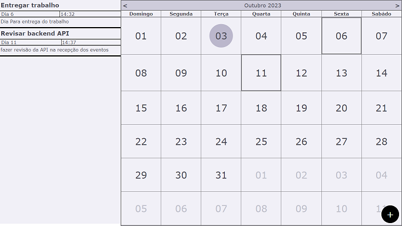

# Scheduler
System to mark events and fire with possibilite to make HTTP requestm created using **PHP(Laravel)** and **Typescript + React** in front end.



To start the program just run **node dev** to resolve any dependence of db, .env and modules.

To start the listener of events to fire run:
```bash
php artisan schedule:work
```